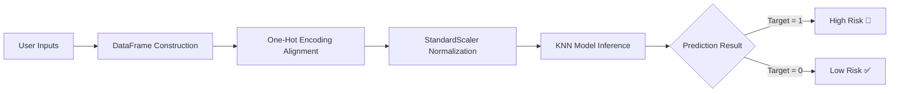

# ❤️ Heart Attack Risk Predictor

[](https://www.python.org/)
[](https://streamlit.io/)
[](https://scikit-learn.org/)
[](LICENSE)

An interactive, Machine Learning-powered Web Application designed to predict the probability of a **Heart Attack Risk** (High 🚨 vs. Low ✅) based on key demographic, clinical, and electrocardiographic metrics.

---

## 📌 Project Overview

Cardiovascular diseases (CVDs) are the leading cause of death globally. Early identification of individuals at risk allows for timely medical interventions and lifestyle modifications. 

This project utilizes a **K-Nearest Neighbors (KNN)** classification model paired with standardized feature scaling and an intuitive **Streamlit** user interface. Users can input clinical parameters (such as blood pressure, cholesterol, ECG results, and peak exercise metrics) to receive instant risk assessments.

---

## ✨ Key Features

- **🎛️ Interactive Web Interface**: A sleek, user-friendly 3-column layout built with Streamlit for seamless data entry.
- **⚡ Instant Risk Assessment**: Real-time evaluation categorizing risk levels as **High Risk 🚨** or **Low Risk ✅**.
- **📊 Standardized Feature Pipeline**: Built-in automated one-hot encoding alignment and feature scaling using `scikit-learn` preprocessors.
- **🎨 Custom Styled Components**: Modernized buttons, responsive container padding, and polished UI theme.

---

## 🩺 Clinical Input Features

The prediction model evaluates 11 key medical & physiological parameters:

| Category | Feature Name | Description & Scale |
| :--- | :--- | :--- |
| **Personal Details** | **Age** | Patient age in years (18 - 90) |
| | **Sex** | Gender (`Male` / `Female`) |
| | **Fasting Blood Sugar** | Fasting blood sugar > 120 mg/dl (`Yes` / `No`) |
| | **Oldpeak** | ST depression induced by exercise relative to rest (0.0 - 6.0) |
| **Clinical Metrics** | **Resting Blood Pressure** | Resting blood pressure in mm Hg (90 - 200) |
| | **Cholesterol** | Serum cholesterol level in mg/dl (100 - 600) |
| | **Maximum Heart Rate** | Peak heart rate achieved during exercise (60 - 220 bpm) |
| | **ST Slope** | Slope of the peak exercise ST segment (`Upsloping`, `Flat`, `Downsloping`) |
| **ECG & Angina** | **Chest Pain Type** | Type of chest pain (`Typical Angina`, `Atypical Angina`, `Non-anginal Pain`, `Asymptomatic`) |
| | **Resting ECG** | Resting electrocardiographic results (`Normal`, `ST-T Wave Abnormality`, `Left Ventricular Hypertrophy`) |
| | **Exercise Angina** | Exercise-induced angina (`Yes` / `No`) |

---

## 🛠️ Tech Stack & Dependencies

- **Programming Language**: Python 3.8+
- **Frontend Framework**: [Streamlit](https://streamlit.io/)
- **Machine Learning**: [Scikit-Learn](https://scikit-learn.org/) (K-Nearest Neighbors Classifier)
- **Data Manipulation**: [Pandas](https://pandas.pydata.org/), [NumPy](https://numpy.org/)
- **Model Serialization**: [Joblib](https://joblib.readthedocs.io/)

---

## 📁 Repository Structure

```text
Heart_prediction/
│
├── frontend.py               # Streamlit application UI & inference handler
├── KNN_Heart.pkl             # Trained K-Nearest Neighbors Classifier model
├── KNN_Heart_Scaler.pkl      # StandardScaler object for feature normalization
├── KNN_Heart_Columns.pkl     # Feature column schema for alignment
├── requirement.txt           # Python dependencies list
└── README.md                 # Project documentation
```

---

## ⚙️ Local Setup & Installation

Follow these steps to set up and run the application locally on your machine:

### 1. Clone the Repository
```bash
git clone https://github.com/Vishesh05-Maurya/Heart.git
cd Heart
```

### 2. Create and Activate a Virtual Environment
- **Windows (PowerShell)**:
  ```powershell
  python -m venv .venv
  \.venv\Scripts\Activate.ps1
  ```
- **macOS / Linux**:
  ```bash
  python3 -m venv .venv
  source .venv/bin/activate
  ```

### 3. Install Dependencies
```bash
pip install -r requirement.txt
```

### 4. Run the Streamlit Application
```bash
streamlit run frontend.py
```

Once executed, the application will open automatically in your default browser at `http://localhost:8501`.

---

## 🔬 Prediction Workflow



1. **Input Collection**: Patient details are gathered through Streamlit sliders and dropdown menus.
2. **Preprocessing**: Input values are formatted into a DataFrame matching the model's exact dummy-encoded column layout (`KNN_Heart_Columns.pkl`).
3. **Scaling**: Standard scaling transformation (`KNN_Heart_Scaler.pkl`) is applied to normalize feature values.
4. **Classification**: The pre-trained KNN model (`KNN_Heart.pkl`) classifies the standardized data and returns the risk level.

---

## 🤝 Contributing

Contributions, issues, and feature requests are welcome! Feel free to check the [Issues page](https://github.com/Vishesh05-Maurya/Heart/issues).

1. Fork the Project
2. Create your Feature Branch (`git checkout -b feature/AmazingFeature`)
3. Commit your Changes (`git commit -m 'Add some AmazingFeature'`)
4. Push to the Branch (`git push origin feature/AmazingFeature`)
5. Open a Pull Request

---

## 📜 License

Distributed under the MIT License. See `LICENSE` for more information.

---

## 👨‍💻 Author

**Vishesh Maurya**
- GitHub: [@Vishesh05-Maurya](https://github.com/Vishesh05-Maurya)
- Repository: [Heart Prediction Repo](https://github.com/Vishesh05-Maurya/Heart)
